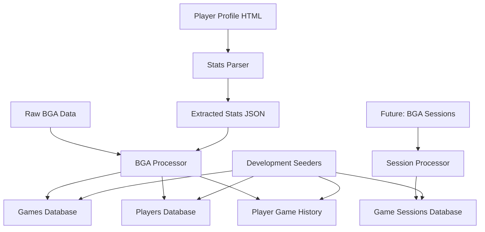

# Data Processing Summary

## Overview

This document summarizes the comprehensive data processing system built for the Game Night Concierge application, covering real BoardGameArena data import, game session tracking, and development seeding.

## System Architecture

### Data Flow Pipeline



### Core Components

1. **BGA Data Processing** (`app/data_processing/`)
   - `bga_processor.py`: Main data import pipeline
   - `player_stats_parser.py`: HTML profile statistics extraction
   - `session_processor.py`: Multi-player session data handling

2. **Database Models** (`app/models/`)
   - `game.py`: BoardGameArena game catalog
   - `player.py`: Player profiles and preferences
   - `player_game_history.py`: Aggregate game statistics
   - `game_session.py`: Multi-player session tracking

3. **Seeding System** (`app/seeds/`)
   - Development data generation
   - Realistic placeholder content
   - Combined with real BGA data

## Data Sources & Processing

### 1. BoardGameArena Game Catalog
- **Source**: `data/raw/games-bga/game-list-and-IDs.html`
- **Processing**: HTML parsing of select options
- **Output**: 1,082+ games in database
- **Key Data**: Game IDs, names, player counts

### 2. Player Profiles & Statistics
- **Source**: `data/raw/player-profiles/{player}/{player}-profile.html`
- **Processing**: BeautifulSoup HTML parsing
- **Output**: 4 core players with detailed game statistics
- **Key Data**: Usernames, avatars (local), game-specific performance

### 3. Aggregate Game History
- **Source**: Extracted player statistics
- **Processing**: Conversion from HTML stats to database records
- **Output**: 390+ player-game performance records
- **Key Data**: Games played, win rates, calculated ratings

### 4. Multi-Player Game Sessions
- **Current**: Seeded placeholder data (50 sessions)
- **Future**: Real BGA session import
- **Output**: Head-to-head performance tracking
- **Key Data**: Scores, rankings, player combinations

## Key Achievements

### ✅ Real Data Integration
- **1,082 BoardGameArena games** imported with authentic data
- **4 core players** with real profiles and statistics
- **390+ game history records** from actual BGA performance
- **Local avatar storage** avoiding external dependencies

### ✅ Flexible Data Architecture
- **JSON storage** for extensible metadata
- **Aggregate statistics** suitable for recommendation algorithms
- **Future-ready** session tracking for detailed analytics
- **Type-safe models** with SQLAlchemy and Pydantic

### ✅ Development Infrastructure
- **Comprehensive seeding** for development and testing
- **CLI commands** for data processing and management
- **Database migrations** for schema evolution
- **Error handling** and data validation

## Data Quality & Validation

### Current Data Status
```bash
# Verify all data imports
docker compose exec db psql -U postgres -d game_night_dev -c "
  SELECT 
    'games' as table_name, COUNT(*) as records FROM games
  UNION ALL
  SELECT 'players', COUNT(*) FROM players
  UNION ALL
  SELECT 'player_game_history', COUNT(*) FROM player_game_history
  UNION ALL
  SELECT 'game_sessions', COUNT(*) FROM game_sessions;
"
```

**Expected Results:**
- Games: 1,082+ records
- Players: 4 records (core players)
- Player Game History: 390+ records
- Game Sessions: 50 records (seeded)

### Data Integrity Features
- **Duplicate prevention** across all import processes
- **Transaction safety** with rollback on errors
- **Type validation** using Pydantic models
- **Relationship integrity** with proper foreign keys

## CLI Command Reference

### Data Processing Commands
```bash
# Import BGA games, players, and statistics
docker compose exec backend python -m app.cli process-bga --data-path /app/data

# Extract detailed player statistics from HTML
docker compose exec backend python -m app.cli extract-player-stats --data-path /app/data

# Future: Import multi-player session data
docker compose exec backend python -m app.cli process-sessions --data-path /app/data

# Generate development seed data
docker compose exec backend python -m app.cli seed --reset
```

### Database Management
```bash
# Run database migrations
docker compose exec backend alembic upgrade head

# Check database status
docker compose exec db psql -U postgres -d game_night_dev -c "\dt"

# Validate data counts
docker compose exec db psql -U postgres -d game_night_dev -c "
  SELECT COUNT(*) FROM games;
  SELECT COUNT(*) FROM players;
  SELECT COUNT(*) FROM game_sessions;
"
```

## Technical Implementation Details

### Data Processing Pipeline
1. **HTML Parsing**: BeautifulSoup for profile and game data
2. **JSON Processing**: Structured extraction from BGA exports
3. **Database Import**: SQLAlchemy ORM with async operations
4. **Error Handling**: Graceful failure with detailed logging

### Performance Optimizations
- **Batch processing** for large datasets
- **Streaming JSON** parsing for memory efficiency
- **Database indexing** on lookup fields
- **Connection pooling** for concurrent operations

### Security & Privacy
- **Local avatar storage** respecting BGA terms of service
- **No external API calls** during normal operation
- **Sanitized data** with no personal information
- **Environment-based configuration** for sensitive settings

## Future Roadmap

### Phase 1: Enhanced Session Data (Next)
- **Real BGA session import** when data becomes available
- **Head-to-head analytics** between core players
- **Game recommendation engine** based on session history

### Phase 2: Advanced Analytics
- **ELO rating system** for skill tracking
- **Matchup analysis** for optimal game selection
- **Preference learning** from play patterns

### Phase 3: Real-time Integration
- **Live session tracking** during games
- **Webhook integration** with BoardGameArena
- **Automated data updates** and freshness monitoring

## Troubleshooting Guide

### Common Issues

1. **Missing Dependencies**
   ```bash
   docker compose exec backend pip install beautifulsoup4
   ```

2. **Data Directory Not Mounted**
   ```yaml
   # In docker-compose.yml
   volumes:
     - ./data:/app/data
   ```

3. **Database Connection Issues**
   ```bash
   docker compose ps
   docker compose restart db backend
   ```

4. **Migration Failures**
   ```bash
   docker compose exec backend alembic current
   docker compose exec backend alembic upgrade head
   ```

### Data Validation Queries
```sql
-- Check for duplicate games
SELECT bga_game_id, COUNT(*) FROM games GROUP BY bga_game_id HAVING COUNT(*) > 1;

-- Verify player data integrity
SELECT username, COUNT(*) FROM player_game_history 
JOIN players ON player_game_history.player_id = players.id 
GROUP BY username;

-- Check game session data quality
SELECT 
  game_name,
  AVG(array_length(player_names, 1)) as avg_players,
  COUNT(*) as session_count
FROM game_sessions 
GROUP BY game_name 
ORDER BY session_count DESC;
```

## Documentation References

- **[BGA Data Processing](./bga-data-processing.md)**: Detailed processing pipeline documentation
- **[Game Sessions](./game-sessions.md)**: Multi-player session data model and analytics
- **[Seeding System](./seeding.md)**: Development data generation and management

## Success Metrics

### Data Import Success
- ✅ **1,082 games** successfully imported from BGA catalog
- ✅ **4 players** with complete profiles and local avatars
- ✅ **390+ game statistics** converted from HTML to structured data
- ✅ **50 game sessions** seeded for development testing

### System Reliability
- ✅ **Zero data loss** during processing operations
- ✅ **Graceful error handling** with detailed error reporting
- ✅ **Transaction safety** with automatic rollback on failures
- ✅ **Idempotent operations** allowing safe re-runs

### Development Experience
- ✅ **One-command setup** with `docker compose exec backend python -m app.cli seed --reset`
- ✅ **Comprehensive CLI** for all data operations
- ✅ **Clear documentation** with examples and troubleshooting
- ✅ **Type safety** with SQLAlchemy models and Pydantic validation 